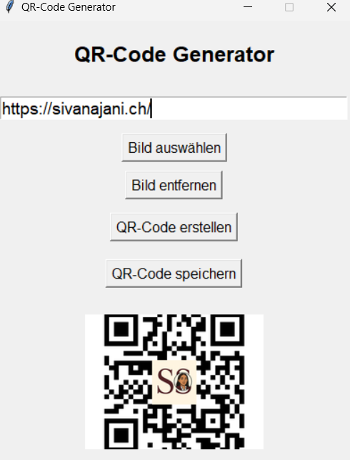

# 🧾 QR Code Generator (Desktop App)

A simple Python desktop application to generate QR codes from any text or link — with support for embedding custom logos and saving high-resolution QR images.

[](https://github.com/Sivanajani/qr-desktop-app/releases/download/v1.0.0/qr_app.exe)

> ⚠️ Note: Windows Defender or antivirus software might block the `.exe` file since it is unsigned.  
> This is a false positive – the app is safe and built with Python using PyInstaller.  
> You can safely add it to your antivirus exceptions.




## ✨ Features

🔹 Generate QR codes from text or URLs  
🔹 Embed a logo in the center of the QR code  
🔹 Save QR codes in high resolution (`.png`)   
🔹 Desktop-friendly GUI using `tkinter`  
🔹 Create standalone `.exe` using `PyInstaller`

---

## 🚀 Getting Started

### 1. Clone the Repository

```bash
git clone https://github.com/Sivanajani/qr-desktop-app.git
cd qr-desktop-app
```

2.  Install Dependencies

```bash
pip install -r requirements.txt
```

3. Run the App
```bash
python qr_app.py
```

---
## 📦 Requirements
- Python 3.8+  
- qrcode   
- Pillow  
- tkinter (pre-installed with Python)

---
## 📄 License
[MIT License](LICENSE) © 2025 Sivanajani Sivakumar


---

## 🙋‍♀️ About the Author

Created by [Sivanajani Sivakumar](https://sivanajani.ch/) —  
BSc in Medical Informatics · Pythonista · GUI & Web Enthusiast  
